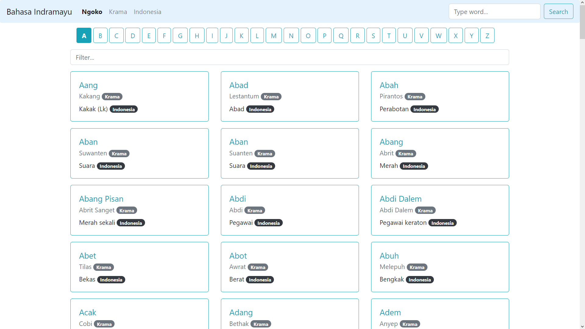

# Kamus Sederhana Bahasa Indramayu
Kamus Sederhana Bahasa Indramayu berisi daftar kata dalam Bahasa Indramayu - Bahasa Indonesia atau Bahasa Indonesia – Bahasa Indramayu. Dirangkum dari buku karya Ibnu Saefullah yang telah direvisi.


## Fitur
- Kamus Bahasa Indramayu berdasarkan pilihan abjad
- Pencarian kata berdasarkan pilihan bahasa (Ngoko, Krama dan Indonesia)

## Persyaratan
- [Node.js](https://nodejs.org/en/download/)
- [MariaDB](https://mariadb.com/downloads/) atau DBMS SQL lainnya

## Instalasi
1. Unduh [bahasa_indramayu.zip](https://github.com/banguncode/bahasa_indramayu/archive/refs/heads/main.zip) atau kloning repository
```bash
git clone https://github.com/banguncode/bahasa_indramayu.git
```
2. Install package
```bash
npm i
```
3. Buka file `db.js` di folder `config/`, sesuaikan konfigurasi database
```environment 
host: 'localhost',
user: 'root',
password: '',
database: 'db_bahasa_indramayu' 
```
4. Jalankan aplikasi
```bash
npm start
```
5. Akses aplikasi pada:
```sh
127.0.0.1:3000
```

## REST API
1. Kamus Bahasa Indramayu berdasarkan pilihan abjad
##### Request

| URI | Method | Keterangan |
| ------ | ------ | ------ |
| `127.0.0.1:3000/{l}` | GET | kamus Bahasa Indramayu berdasarkan pilihan abjad |

##### Data

| Parameter | Tipe | Keterangan |
| ------ | ------ | ------ |
| `l` | String | huruf A-Z |

##### Response
| Kode | Status | Keterangan |
| ------ | ------ | ------ |
| `200` | OK | sukses |
    {
        "status": "SUCCESS",
        "data": "..."
    }
| Kode | Status | Keterangan |
| ------ | ------ | ------ |
| `400` | Bad Request | permintaan tidak lengkap |
| `404` | Not Found | data tidak ditemukan |
| `500` | Internal Server Error | terjadi galat |
2. **Pencarian kata berdasarkan pilihan bahasa (Ngoko, Krama dan Indonesia)**
##### Request

| URI | Method | Keterangan |
| ------ | ------ | ------ |
| `127.0.0.1:3000/search` | GET | pencarian kata berdasarkan pilihan bahasa (Ngoko, Krama dan Indonesia) |

##### Data

| Parameter | Tipe | Keterangan |
| ------ | ------ | ------ |
| `q` | String | kata kunci |
| `lang` | String | bahasa asal `nk`, `km` atau `id` (default: `nk`) |

##### Response
| Kode | Status | Keterangan |
| ------ | ------ | ------ |
| `200` | OK | sukses |
    {
        "status": "SUCCESS",
        "data": "..."
    }
| Kode | Status | Keterangan |
| ------ | ------ | ------ |
| `400` | Bad Request | permintaan tidak lengkap |
| `404` | Not Found | data tidak ditemukan |
| `500` | Internal Server Error | terjadi galat |
## Colek
- [Express](https://expressjs.com/)
## Kontribusi

Pull requests dipersilakan. Untuk perubahan besar, harap buka issue terlebih dahulu untuk membahas apa yang ingin diubah.

## Donasi

Jika berkenan bantu saya membeli kopi, rokok dan gorengan.

> PayPal
**rum.haidar@hotmail.com**

> BRI
**421401001171502**
a/n RUM HAIDAR FAUZAN

> BCA
**8610736051**
a/n RUM HAIDAR FAUZAN

> JENIUS
**90013536859**
a/n RUM HAIDAR FAUZAN

> OVO/GOPAY/LinkAja
**089653129960**
a/n RUM HAIDAR FAUZAN

## License
[GNU GPLv3 ](https://choosealicense.com/licenses/gpl-3.0/)
